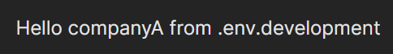

# Loading different .ENV based on scripts

Imagine the usecase where the same code has to work for multiple different comapanies with minimal change.

So each company has the different environment variables to be loaded like api urls, database urls etc.

So to maintain this data we will store them on seperate `.env` files like `.env.companyA` contains the companyA environment variables and `.env.companyB` contains the companyB environment variables.

For the above usecase, I implemented a simple example demonstration of how to load and serve the different environment varaibles from the [npm scripts](https://docs.npmjs.com/cli/v10/using-npm/scripts).

*Note: Vite uses the [dotenv](https://www.npmjs.com/package/dotenv) to load the environment variables and exposes those variables to the client code only if the variables are prefixed with [`VITE_`](https://vitejs.dev/guide/env-and-mode.html#env-files)*

The `scripts` section of the `package.json` includes the `"dev"`, `"companyA"` and `"companyB"` like below

```json
"scripts": {
    "dev": "vite",
    "companyA": "cross-env VITE_ORGANIZATION=companyA vite",
    "companyB": "cross-env VITE_ORGANIZATION=companyB vite"
}
```

- `"dev"` - This script loads and execute the default environment variables mentioned in `.env.development` like default organization is `companyA`.
- `"companyA"` - This script loads the `.env.development` and override the `VITE_COMPANY_A` environment variable with the `.env.development.companyA`'s variable.
- `"companyB"` - This script loads the `.env.development` and override the `VITE_COMPANY_B` environment variable with the `.env.development.companyB`'s variable.

The `"companyA"` and `"companyB"` scripts uses the [cross-env](https://www.npmjs.com/package/cross-env) npm package, to set the `VITE_ORGANIZATION` environment variable dynamically during run-time. So it overrides the default `VITE_ORGANIZATION` specified in the `.env.development` file.

The next big task is to load the seperate `.env` file of the `companyA` or `companyB` based on the `VITE_ORGANIZATION` environment variable.

So to load these different environment files we use `resolve()` method from `path` and `dotenv` to load the currently set `VITE_ORGANIZATION`.

**vite.config.js**
```js
import { defineConfig } from 'vite'
import dotenv from 'dotenv'
import { resolve } from 'path'
import react from '@vitejs/plugin-react'

// https://vitejs.dev/config/
export default defineConfig(() => {
  const org = process.env.VITE_ORGANIZATION || '';
  const envFilePath = resolve(__dirname, `.env.development.${org}`);
  dotenv.config({ path: envFilePath })
  return {
    plugins: [react()]
  }
})
```

So to change any configuration of the `vite` project we have to modify that in the *vite.config.js*. Let us see the explanation of the above code.

The line 1, imports the `defineConfig` from the `vite` which is used to override/modify the default configuration of a vite project. And the 2nd, 3rd lines import the required modules for loading the seperate `.env` file.

We are passing an arrow function as a parameter to the `defineConfig` which returns the react `plugins`. Now before returning this `plugins` the code takes the current organization using the `process.env` by `dotenv` and store stores it in `org` variable.

Now by using `resolve` method, we can get the exact path of the `.env` file by using the `org` variable suffix. After resolving that specific company .env file we will store that to a `envFilePath` variable and pass it as a new config path for the `dotenv` to load all the specific company environment variables.

### Execution Steps

1. Clone this repository
2. Make sure you have nodejs and npm installed.
3. Run `npm install` to install the dependencies of this project.
4. Execute the below commands in the terminal or command prompt

    ```bash
    npm run dev
    ```

    Output

    

    ```bash
    npm run companyA
    ```

    Output

    

    ```bash
    npm run companyB
    ```

    Output

    